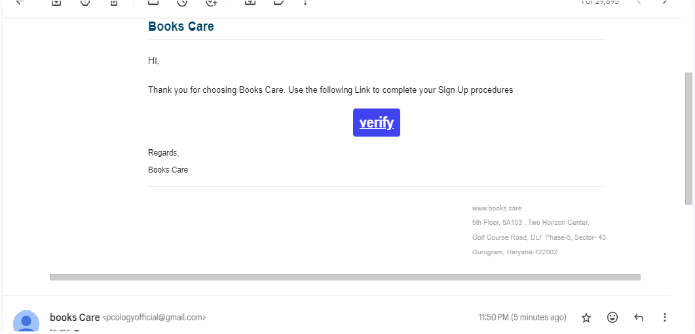
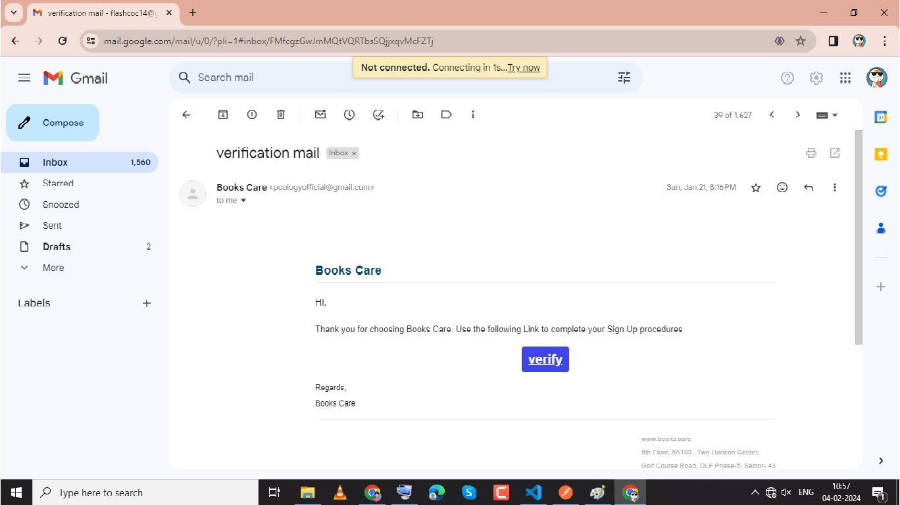
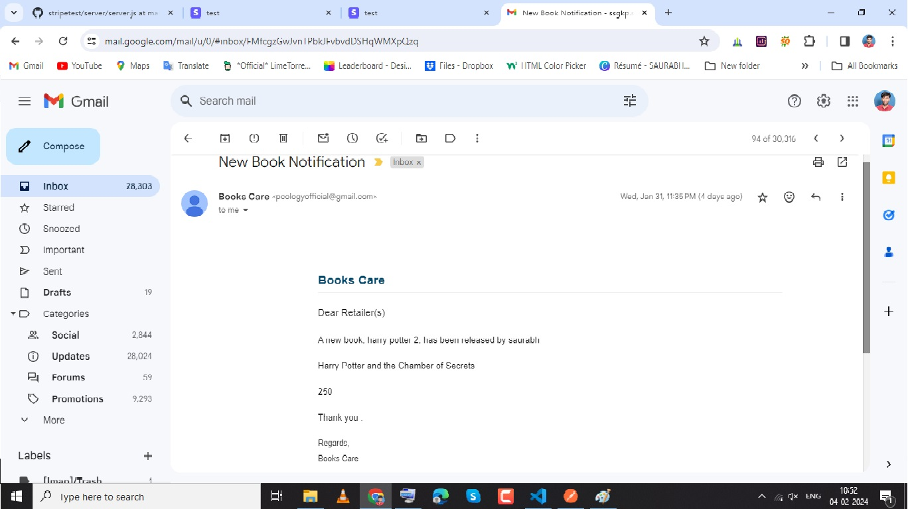
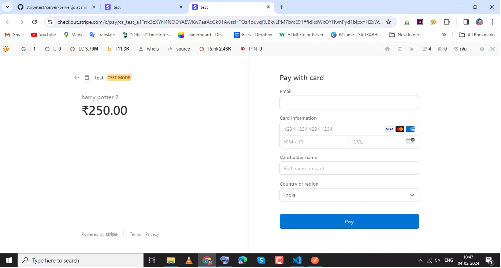

# Backend Development for a
Book Store Application(bookcares)
This is a sample bookstore project implemented in Node.js using Express, Mongoose, Bull, and Nodemailer.
Login and Registration System with Full Validation, Tokens, Super Admin, OTP-Based Forgot Password, Notifications, Books CRUD, User Requests, Roles & Permissions, and User Activity Log.
### Set up your database and environment variables.   
 ### .env
```
CONNECTION_URL="mongodb+srv://###"

PORT = 4000

JWT_SECRET="saurabh"

USER_EMAIL=your@gmail.com

USER_PASSWORD= mfalyqlhbn

BASEURL='http://localhost:4000/v1/'
```
### `SellCount Logic`

The `sellCount` attribute is computed dynamically based on the purchase history. It represents the total number of times a book has been sold. The logic involves querying the purchase history for the specific book and summing up the quantities purchased.

```javascript
// Example Mongoose query to compute sellCount
const sellCount = await PurchaseHistory.aggregate([
  {
    $match: { bookId: 'book-1' } // Replace with the actual bookId
  },
  {
    $group: {
      _id: null,
      totalSold: { $sum: '$quantity' }
    }
  }
]);

// Extract the total sell count from the result
const totalSellCount = sellCount.length > 0 ? sellCount[0].totalSold : 0;
```
### `Mechanism for Sending Email Notifications`
The uploadEmailProcessor module exports an asynchronous function that is designed to send email notifications.
It uses the Nodemailer library to create a transport object configured with Gmail SMTP settings.
For each email address provided in the job data, it sends an email with the specified subject, text, and HTML content.
```javascript
// uploadEmailProcessor.js
const nodemailer = require('nodemailer');
module.exports = async function (job) {
    try {
        let transporter = nodemailer.createTransport({
            service: 'gmail',
            host: 'smtp',
            secure: true,
            auth: {
                user: process.env.USER_EMAIL,
                pass: process.env.USER_PASSWORD,
            },
        });
        for (let i = 0; i < emails.length; i++) {
            const mailOptions = {
                from: `"Books Care" <${process.env.FROM}>`,
                to: emails[i].email,
                subject: job.data.subject,
                text: job.data.text,
                html: job.data.html,
            };
            await transporter.sendMail(mailOptions);
        }
    } catch (e) {
        console.log(e)
    }
};

```
The uploadEmailQueue is an instance of the Bull queue named 'Email Queue'.
It is configured to use Redis as a backend (redis://127.0.0.1:6379).
The uploadEmailQueue.process method defines the processing logic for the queue,

```
// bullQueue.js
const Queue = require('bull');
const path = require('path');
const uploadEmailProcessor = require('./processors/uploadEmail');

// Get the current directory path
const currentPath = __dirname;

// Get the parent directory path
const parentPath = path.dirname(currentPath);
const redisUrl = 'redis://127.0.0.1:6379'

const uploadEmailQueue = new Queue('Email Queue', redisUrl);

uploadEmailQueue.process((job) => uploadEmailProcessor(job));

module.exports = {
    uploadEmailQueue,
};

```


### `Discuss the choices made in terms of database design and implementation.`
When designing and implementing a database for a bookstore project using MongoDB, several considerations and choices need to be made. Below are some key aspects of database design and implementation for this project:
### Data Model:

Books Collection: The primary collection holds information about books. Each document in the collection represents a unique book and includes attributes such as `bookId, authors, sellCount, title,slugURL,description, and price.`
Purchase History Collection: A separate collection is used to store purchase history. Each document in this collection corresponds to a purchase transaction and includes attributes `like purchaseId, bookId, userId, purchaseDate, price, and quantity.
Primary Keys and Indexing:`

`Indexing on bookId and userId:` Indexing these fields in the Purchase History collection can improve query performance when fetching purchase history for a specific book or user.
### SellCount Calculation:
Dynamic Computation: The sellCount attribute in the Books collection is computed dynamically based on the aggregated sum of quantities sold from the Purchase History collection.
### Normalization vs. Denormalization:
Denormalization for Performance: Denormalization is used for the sellCount attribute to avoid the need for frequent computations during read operations. This improves read performance at the expense of potential data inconsistency, which is mitigated by updating the sellCount periodically.
### Data Consistency:
Atomic Operations: MongoDB supports atomic operations on a single document, ensuring that updates to the sellCount field are atomic. This helps maintain data consistency during concurrent updates.
### Mongoose Schema:
Validation and Schema Definition: Mongoose schemas are used to define the structure of documents in the MongoDB collections. This includes specifying data types, enforcing required fields, and defining custom validations.

### Bull Queue for Asynchronous Processing:
Bull Queue for Email Notifications: The use of a job queue (Bull) ensures asynchronous processing of email notifications. This helps decouple the email sending process from the main application flow, improving responsiveness.
Security Considerations:

### Scalability Considerations:
Horizontal Scaling: MongoDB allows for horizontal scaling through sharding. Considerations for future scalability involve designing the database to handle increased data volumes and concurrent users.
### Data Modeling for Email Notifications:

Separate Collection for Email Queue: The decision to have a separate collection for email notifications in the job queue (Bull) ensures a clean separation of concerns and facilitates easy monitoring and management of email-related jobs.


  <!--   -->
  
  
 
  
## Introduction

This project is a comprehensive implementation of a login and registration system with various features such as full validation, JWT tokens for secure authentication, Super Admin functionality, OTP-based forgot password, notifications, CRUD operations for books, user book purchase, roles & permissions, and user purchase logging. stripe payment gateway.
Use a background job or a message queue to handle email notifications asynchronously.
Include relevant purchase information in the email.

## Features

- User Registration with Full Validation (Email, Password, Profile) verification Link sent to gmail
- Secure Login with JWT Tokens
- Super Admin Functionality (Login, Forgot Password, Update Profile)
- Super Admin Can Create Users, See All Users, Activate/Deactivate Users
- OTP-Based Forgot Password with Email Notification
- Books CRUD Operations
- Roles & Permissions
- title : Unique string value -> make sure the title can be used as a slug for the book URL.
- Increase in author's revenue on user purchase
Notify authors about purchase information
### Email Notification:
Use a background job or a message queue to handle email notifications asynchronously.
Include relevant purchase information in the email.
Add a feature for sending bulk email notifications to all the retail users about new book releases..
there is one condition like in one minute only 100 emails can be sent. So, we need to handle this
condition.
## stripe payment gateway
Implement secure payment processing for book purchases. integration 
     